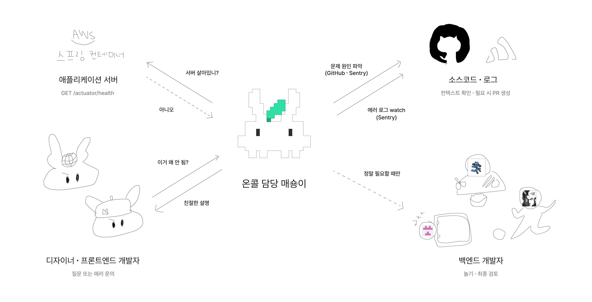

#  TMT-oncall

딸깍팀 백엔드의 장애∙문의를 사람이 개입하기 전에 자동으로 진단하고,
필요한 조치 후 팀 채널에 보고하는 상주 에이전트.




<!--
봇은 Oracle Cloud VM에 systemd로 상주하며 세 가지 신호를 받는다.

| 트리거 | 소스 | 하는 일 |
|---|---|---|
| 에러 | Sentry 이슈 (1분 주기 폴링) | 신규·재발 이슈를 분석해 장애 리포트 |
| 서비스 다운 | `GET /actuator/health` 폴링 | 직전 이벤트를 모아 다운 리포트 |
| 질문 | Discord be-온콜 채널 | 질문자 역할에 맞춘 톤으로 답변 |

인바운드 엔드포인트는 열지 않는다. 봇이 나가서 가져오므로 **앱이 죽어도 봇은 살아서 알린다.**

## 두 가지 원칙

**사람이 분석과 실행 사이를 끊는다.** 봇은 코드를 자동으로 고치지 않는다. 원인과 수정 계획을
먼저 보여주고, 사람이 `PR 만들기` 버튼을 눌러야 티켓·브랜치·PR로 넘어간다. 머지는 하지 않는다.

**멈추더라도 알림은 마지막까지 살린다.** 호출·비용 상한에 다다르면 봇을 통째로 멈추는 대신
비싼 경로부터 끊는다 — 수정·PR이 먼저 막히고, 에러 알림은 끝까지 남는다.

## 답변 톤

질문자의 Discord 역할이 그대로 답변 톤이 된다.

- **디자인** — CS 응대 톤. 무엇이 안 되고 언제 고쳐지는지만
- **웹** — 엔드포인트·상태 코드·응답 필드는 그대로, FE가 뭘 바꿔야 하는지 명확히
- **스프링** — 스택트레이스·클래스·라인 그대로

역할이 없으면 디자인 톤으로 답한다. 에러 리포트는 역할과 무관하게 항상 스프링 톤이다.

## 개발

```bash
./gradlew build
```

테스트는 자격 증명 없이 돈다. 에이전트 CLI는 같은 계약을 흉내내는 스크립트로, Sentry는
`MockRestServiceServer`로 대체하며 외부로 나가는 호출이 없다.

## 문서

- [설계 스펙](docs/SPEC.md) — 트리거·모델 선택·비용 상한·안전장치·환경변수
- 프롬프트는 이 레포에 두지 않는다. `MT-marketplace`의 `be-oncall-kit` 플러그인이 갖는다


-->